# Library Managament System (REST APP)
## Author: Kevin Delao

## Table of contents

* [Introduction](#intro)
* [General info](#general-info)
* [Technologies](#technologies)
* [Site](#site)
* [Setup](#setup)

## Introduction
The goal of this project was to create simple library managment system. This project was inspired from a part time job I had working in a library during my undergraduate studies.
I wanted to see if I could build a simple software application that replicated the software I used working as a librarian in order to see what goes into the software thats used to
manage book returns and book borrowing. This applications allows for the creation of books and students and also for students to return and borrow books. Overall this project 
was also a way to work on various aspects of programming that I learned from my CS courses.
## General info
This application is a full stack application in that HTML and CSS is used for the front end and JAVA and MYSQL is used to handle the backend. More specifically HTML + Thymeleaf is used to
to show forms entries and data from the MySQL database. Thymeleaf MVC was chosen over JSP due the simplicity of Thymeleaf at displaying class objects. For the backend Spring REST was used to easily communicate between Java and my local MySQL database. 
	
## Technologies
Project was created with:
* Java JDK 11
* HTML
* CSS
* MYSQL
* Thymeleaf
* Spring REST, Spring MVC
* IDE: IntelliJ Community Edition (2020)

## Site

### Homepage
The homepage serves to display the currently available books in the library. The Book entities have attributes assoicated with it such as ISBN, Title, Author, Publisher, and Stock. 
Each book also has an action tab that lets someone edit the book information or delete the book if it's not being borrowed.

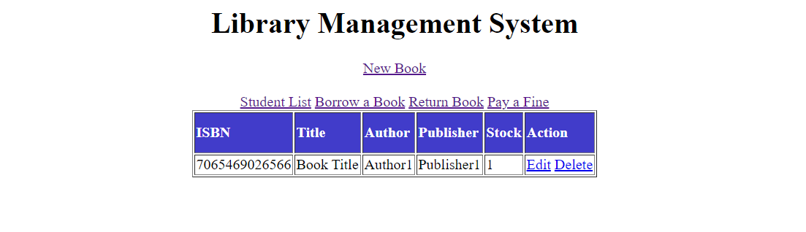

### New Book
 The new book form allows a user to create a new book and also specify the stock available for that book (min has to be 1). The book generated will have a randomly generated ISBN
 that is 13 characters long as books now have ISBN's with 13 numbers.
  

 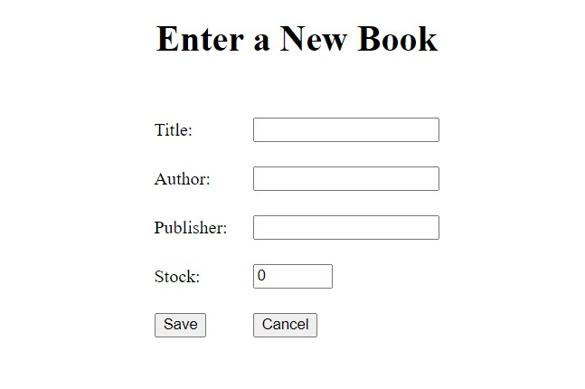
 
### Edit Book
The edit book allows for the editing of information of the book with the exception of the ISBN which is unchangable
 
 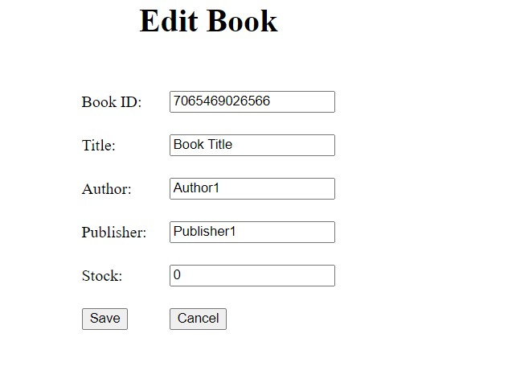
 
### Borrow Book
The Borrowed Book page will accept a the ISBN of the book being borrowed as well as the ID of the student borrowing the book. Additionally, the borrow date and the due date for the book 
can be selected. If the due dates have an error or if any error occurs the custom error messages will display.
  
 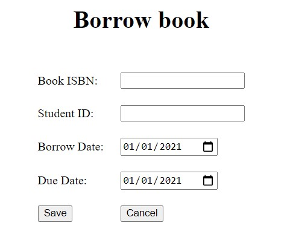

### Return Book

The return book page will allow a student to return a book. The page itself also allows for the return date to selected. If the return date of the book is greater than the due date then
a 5 dollar fine will be added to the students debt.
 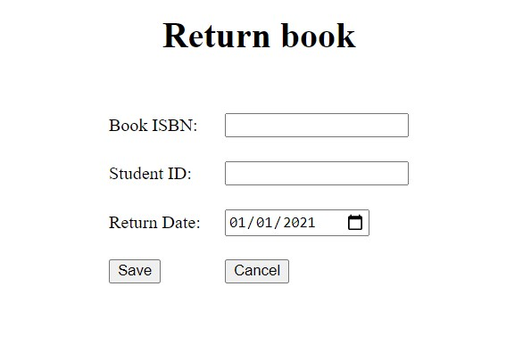

### Fine Payment

The fine payment will simply allow a student to pay of any fines they have. The page will show the list of all the students in the system as well as how much money they owe.  
 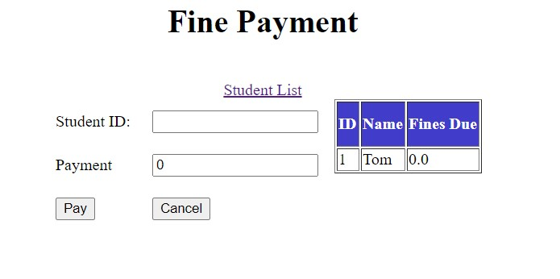

### Student List
The Student list page displays the students currently registered with the library system. The student list has two links that leads to pages to create a new student and to return to the home page.
Additionally, the student list also has an action tab similar to the homepage. Furthermore the Student list has a tab called borrowed books that leads to the page that shows the books
borrowed by the student.

 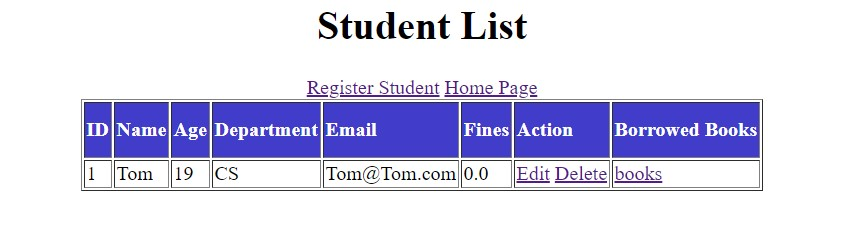

### Register Student
The register student page allows for entry of various attributes of a student such as name,age etc. Age has to have a minumum number as well and will not allow for the entry of characters.
The student generated will have an autogenerated ID that will be incremental.

 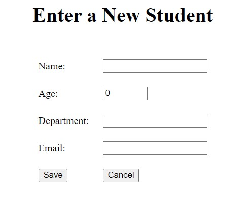

### Edit Student

Similar to the edit books page, the edit student page allows for the editing of the student information with the exception of ID and fines due.
 
 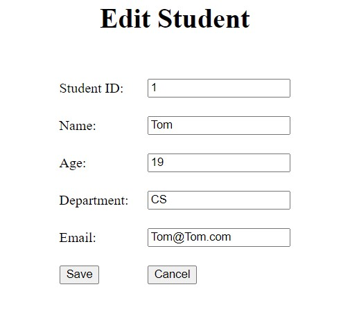
 
### Borrowed Books
The Borrowed Books page shows the list of books each student borrowed along with the borrow and due date for the book.
 
 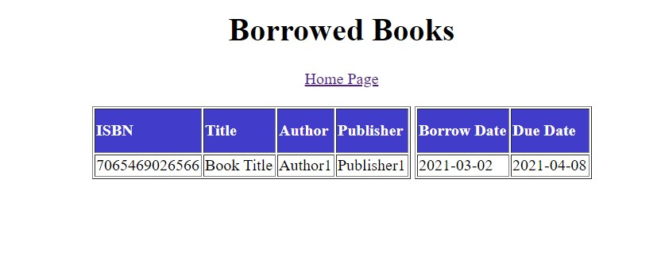
 
### Error Handling

Various custom error messages will display depending on the issue such as a student trying to borrow a book they already borrowed.
 
 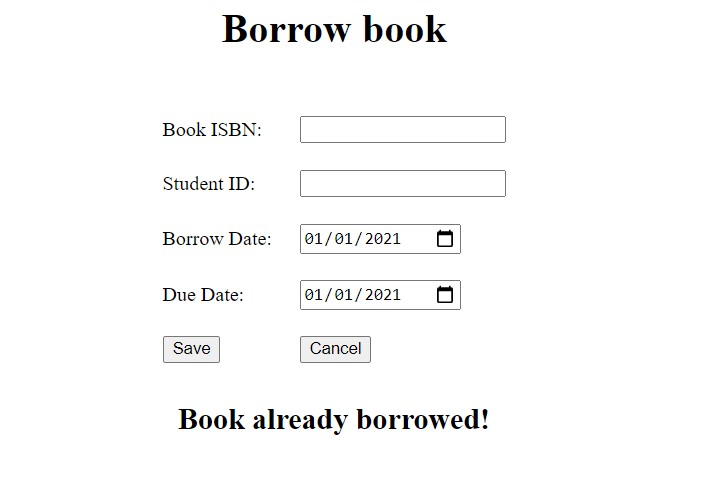

## Setup
To run this project, simply run SpringBootLibraryApplication which starts the spring application. The pom file included with will download all the necessary libraries needed to 
succesfully run the project. Additionally, to connect to a database locally or on AWS simply edit the application.yml for the database url as well as include a username or password
if the database is password protected.

