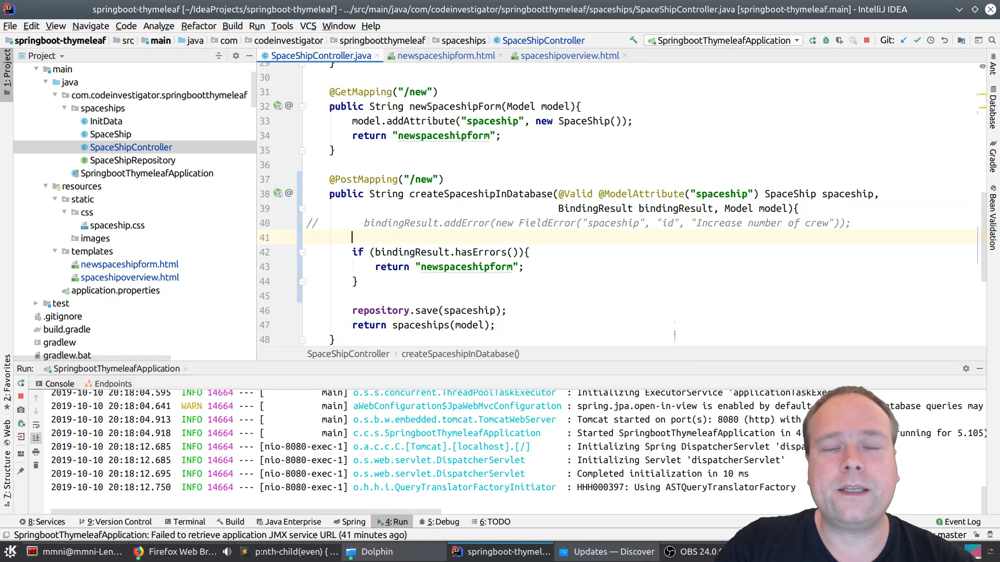

# Library Managament System (REST APP)
##Author: Kevin Delao

## Table of contents

* [Introduction] (#intro)
* [General info](#general-info)
* [Technologies](#technologies)
* [Setup](#setup)
* [Site] (#site)
## Introduction
The goal of this project was to create simple library managment system. This project was inspired from a part time job I had working in a library during my undergraduate studies.
I wanted to see if I could build a simple software application that replicated the software I used working as a librarian in order to see what goes into the software thats used to
manage book returnals and book takeouts. This applications allows for the creation of books and students and also also for students to return and borrow books. Overall this project 
was also a way to combine various 
## General info
This application is a full stack application in that HTML and CSS is used for the front end and JAVA and MYSQL is used to handle the backend. More specifically HTML + Thymeleaf is used to
to show forms entries and data from the MySQL database. Thymeleaf was chosen over JSP due the simplicity of Thymeleaf at displaying class objects. For the backend Spring REST was used to easily
to have easy communication between Java objects and my local MySQl database. 
	
## Technologies
Project was created with:
* Java JDK 11
* HTML
* CSS
* MYSQL
* Thymeleaf
* Spring REST
* IDE: IntelliJ Community Edition (2020)

## Site

### Homepage

## Setup
To run this project, simply run SpringBootLibraryApplication which starts the spring application. The pom file included with 

